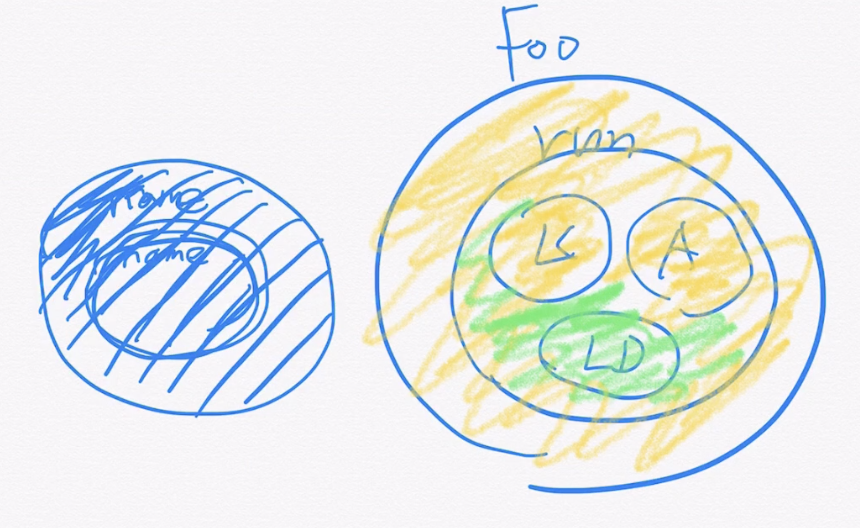

#Section 1

[참고 링크](https://github.com/whiteship/java8)

## 자바 8

- LTS 버전
- 출시일 : 2014년 3월(출시까지 3년반이 걸렸음)
- 현재 자바 개발자 중 83%가 사용중

### LTS(Long-Term-Support)와 비-LTS 버전의 차이

- 비-LTS는 업데이트 제공 기간이 짧다.
- 비-LTS 배포 주기 6개월
- 비-LTS 지원 기간은 배포 이후 6개월
- LTS 배포 주기 3년 (매 6번째 배포판이 LTS가 된다.)
- LTS 지원 기간은 5년이상으로 JDK를 제공하는 밴더와 이용하는 서비스에 따라 다르다.
- 실제 서비스 운영 환경(production)에서는 LTS 버전을 권장한다.
- [Moving Java Forward Faster-Mark Reinhold](https://mreinhold.org/blog/forward-faster)
  > 자바를 다양한 feature에 넣으면서 배포주기도 빨라지고, 기능도 추가하고, LTS도 관리하며, 안정화시키는 것!
  > 자바를 조금 더 계속해서 패러다임에 맞춰나가는 것. 안정화시키는 작업이라고 봄
  > 자바 9버전 이후 부터는 6개월마다 출시되고 있음.
  > 8,11을 제외하곤 비-LTS다 보니 8의 점유율이 상당히 높다.
- 다음 LTS: 자바 17(8->11->17)
- 매년 3월과 9월에 새 버전 배포

## 주요 기능

- 람다 표현식
- 메소드 레퍼런스
- 스트림 API
- Optional<T>

# 2부 함수형 인터페이스와 람다 현식

## 2. 함수형 인터페이스와 람다 표현식 소개

### 함수형 인터페이스(Functional Interface)

- 추상 메서드를 딱 하나만 가지고 있는 인터페이스(중요)
  - 두 개가 있으면 안된다! (abstract 생략되어있음)
  - public, static의 경우도 적용 가능함.

```java
@FunctionalInterface
public interface RunSomething {
    void doIt();

    static void printName(){
        System.out.println("Jihyeon");
    }
    default void printAge(){
        System.out.println("40");
    }
}
```

> 추상메서드가 몇개인지가 중요하다.(여기서는 1개)

- SAM(Single Abstract Method) 인터페이스
- @FunctionalInterface 애노테이션을 가지고 있는 인터페이스

### 람다 표현식(Lambda Expressions) ->option + enter 누르면 람다로 변환 가능!!

```java
public class Foo {
    public static void main(String[] args){
        //익명 내부 클래스
        RunSomething runSomething = () -> {
            System.out.println("Hello");
            System.out.println("Lambda");
        };
    }
}
```

> 특수한 형태의 오브젝트로 보면 된다!

- 함수형 인터페이스의 인스턴스를 만드는 방법으로 쓰일 수 있다.(간단하기 때문에)
- 코드를 줄일 수 있다.
- 메소드 매개변수, 리턴 타입, 변수로 만들어 사용할 수 있다.

### 자바에서 함수형 프로그래밍

- 함수를 First Class Object로 사용할 수 있다.
- 순수함수(Pure function)
  - 사이드 이펙트가 없다.(<- 함수 밖에 있는 값을 변경하지 않는다.)
  - 상태가 없다.(함수 밖에 있는 값을 사용하지 않는다.)
    > 함수 밖의 변수(외부변수)를 활용하는 경우 순수한 함수라고 보기 어렵다.
    > 익명 내부 클래스 안이면서 함수 밖의 변수이면 문법적으로 문제가 없기는 하지만, 그럼에도 불구하고 순수한 함수라고 보긴 어려움.
    > 또한 외부 변수를 final(effective final -> 추후 설명)로 가정하기에, 함수 외부에서 또다른 조작은 하면 안된다!
- 고차 함수(Higher-Order Fu)nction)
  - 함수가 함수를 매개변수로 받을 수 있고 함수를 리턴할 수도 있다.
- 불변성

```java
public class Foo {
    public static void main(String[] args){
        //익명 내부 클래스
        RunSomething runSomething = (number) -> {
            return number + 10;
        };
        System.out.println(runSomething.doIt(1));
        System.out.println(runSomething.doIt(1));
    }
}
```

> 같은 값을 넣은 경우 같은 결과가 나오는 것도 함수의 역할이다! (여기서는 doit을 int로 리턴함)

---

## 3. 자바에서 제공하는 함수형 인터페이스

### Java가 기본으로 제공하는 함수형 인터페이스

- [java.util.function 패키지](https://docs.oracle.com/javase/8/docs/api/java/util/function/package-summary.html)

| 자바에서 미리 정의해둔 자주 사용할만한 함수 인터페이스 |
| ------------------------------------------------------ |
| Function <T,R>                                         |
| BiFunction <T,U,R>                                     |
| Consumer <T>                                           |
| Supplier<T>                                            |
| Predicate<T>                                           |
| UnaryOperator<T>                                       |
| BinaryOperator<T>                                      |

#### Function<T,R>

- T타입을 받아서 R 타입으로 리턴하는 함수 인터페이스(두 타입이 다를 수 있다! )

  - R apply(T t) (apply가 메소드)

  ```java
    import java.util.function.Function;

    public class Plus10 implements Function<Integer, Integer> {
        @Override
        public Integer apply(Integer integer){
            return integer+10;
        }
    }

    public class Foo {
        public static void main(String[] args){
            Plus10 plus10 = new Plus10();
            System.out.println(plus10.apply(1));
        }
    }
    //11
  ```

  > 아래와 같이 간략하게 표현도 가능함!

```java
import java.util.function.Function;

public class Foo {
    public static void main(String[] args){
        Function<Integer, Integer> plus10 = (i) -> i+10;
        System.out.println(plus10.apply(1));
    }
}
```

- 함수 조합용 메소드

  - andThen
  - compose

```java
import java.util.function.Function;

public class Foo {
    public static void main(String[] args){
        Function<Integer, Integer> plus10 = (i) -> i+10;
        Function<Integer, Integer> multiply2 = (i) -> i*2;
        //System.out.println(plus10.apply(1));
        //System.out.println(multiply2.apply(1));
        Function<Integer, Integer> multiply2AndPlus= plus10.compose(multiply2);
        System.out.println(multiply2AndPlus.apply(2));
        //14
        System.out.println(plus10.andThen(multiply2).apply(2));
        //24

    }
}
```

> 단발적으로 할수도 있지만, compose를 활용하면 내부 수행(2*2)후 외부 수행(4+10)
> andThen하면 앞의 것 수행(10+2)후 뒤의 것 수행(12*2)가 된다!

#### BiFunction<T,U,R>

- 두 개의 값(T,U)를 받아서 R 타입을 리턴하는 함수 인터페이스
  - R apply(T t, U u)
    > Function<T,R>과 유사해서 생략!

#### Consumer<T>

- T 타입을 받아서 아무값도 리턴하지 않는 함수 인터페이스
  - void Accept(T t)

```java
  public class Foo {
    public static void main(String[] args){
        Consumer<Integer> print = (i)-> System.out.println(i);
        print.accept(10);
    }
}
```

> 겉보기엔 그닥 쓸모 없어 보인다.

- 함수 조합용 메소드
  - andThen

#### Supplier<T>

- T 타입의 값을 제공하는 함수 인터페이스
- 받지 않고 받아올 값을 정의한다! (따라서 인자가 없다. 여기서는 10을 리턴함!)
  - T get()

```java
public class Foo {
    public static void main(String[] args){
        Supplier<Integer> get10 = () -> 10; //매개변수가 없다!!
        System.out.println(get10.get());
    }
}
```

#### Predicate<T>

- T 타입을 받아서 boolean을 리턴하는 함수 인터페이스
  - boolean test(T t)
- 함수 조합용 메소드
  - And
  - Or
  - Negate

```java
public class Foo {
    public static void main(String[] args){
        Predicate<String> startsWithJihyeon = (s) -> s.startsWith("Jihyeon");
        Predicate<Integer> isOdd = (i) -> i%2 == 1;
        System.out.println(startsWithJihyeon.test("Jihyeonis"));
        System.out.println(isOdd.test(2));
    }
}
```

#### UnaryOperator<T>

- Function<T,R>의 특수한 형태로, **입력값 하나를 받아서 동일한 타입을 리턴**하는 함수 인터페이스

```java
public class Foo {
    public static void main(String[] args){
        UnaryOperator<Integer> plus10 = (i) -> i + 10;
        System.out.println(plus10.apply(10));
    }
}
```

#### BinaryOperator<T>

- BiFunction<T,U,R>의 특수한 형태로, 동일한 타입의 입력값 두개를 받아 리턴하는 함수 인터페이스
  > 세개의 타입이 다 다를 것이라는 가정하에 만들어진 것임.
  > BiFucntion의 특수한 형태!

| 자바에서 미리 정의해둔 자주<br> 사용할만한 함수 인터페이스 | 정리                                                  |
| :--------------------------------------------------------: | ----------------------------------------------------- |
|                       Function <T,R>                       | T라는 변수를 받아서 R로 리턴, apply, andThen, Compose |
|                     BiFunction <T,U,R>                     | Function과 유사한데 2개의 매개변수 받음               |
|                        Consumer <T>                        | 리턴이 없다                                           |
|                        Supplier<T>                         | 매개변수가 없고 받아올 값을 정의한다.                 |
|                        Predicate<T>                        | boolean으로 변환하여 테스트한다.                      |
|                      UnaryOperator<T>                      | 입력 값 하나 받아서 동일한 타입으로 리턴              |
|                     BinaryOperator<T>                      | 동일한 타입 두개를 받아 리턴                          |

### Function 문서!

## [Funciton](https://docs.oracle.com/javase/8/docs/api/java/util/function/package-summary.html)

---

# 4. 람다 표현식

## 람다

- (인자 리스트) -> {바디}

## 인자리스트

- 인자가 없을 때 : ()
  ```java
  Supplier<Integer> su = () -> 10;
  ```
- 인자가 한개일 때 : (one) 또는 one
- 인자가 여러개 일 때 : (one,two)
  ```java
  BinaryOperator<Integer> sum = (a,b) -> a+b;
  ```
- 인자의 타입은 생략 가능, (변수 선언부에 정의되어 있어서) 컴파일러가 추론하지만 명시할 수 도 있다. (Integer one, Integer two)
  ```java
  BinaryOperator<Integer> sum = (Integer a,Integer b) -> a+b;
  ```

## 바디

- 화살표 오른쪽에 함수 본문을 정의한다.
- 여러 줄인 경우에 {}를 사용해서 묶는다.
- 한 줄인 경우에 생략 가능, return도 생략 가능

## 변수 캡쳐(variable Capture)

- 로컬 변수 캡처
  ```java
  public class Foo {
      public static void main(String[] args){
          Foo foo = new Foo();
          foo.run();
      }
      private void run() {
          int baseNumber = 10;
          IntConsumer printInt = (i) -> System.out.println(i+baseNumber);
          printInt.accept(10);
      }
  }
  ```
  > baseNumber라는 로컬 변수가 캡쳐된다.
  - final이거나 effective final인 경우에만 참조할 수 있다.
  - 그렇지 않을 경우 concurrency 문제가 생길 수 있어서 컴파일러가 방지한다.

### Local에서 참조

```java
public class Foo {
    public static void main(String[] args){
        Foo foo = new Foo();
        foo.run();
    }
    private void run() {
        final int baseNumber = 10;
        //로컬
        class LocalClass{
            void printBaseNumber(){
                System.out.println(baseNumber);
            }
        }
        //익명
        Consumer<Integer> integerConsumer = new Consumer<Integer>(){
            @Override
            public void accept(Integer integer){
                System.out.println(baseNumber);
            }
        };
        //람다
        IntConsumer printInt = (i) -> System.out.println(i+baseNumber);
        printInt.accept(10);
    }
}
```

- **effective final**
  - 자바 8부터 지원하는 기능으로 **"사실상"final**인 변수
  - final 키워드 사용하지 않은 변수를 익명 클래스 구현체 또는 람다에서 참조할 수 있다.
- 익명 클래스 구현체와 달리 shadowing하지 않는다.
  - 익명 클래스는 새로 scope을 만들지만, 람다는 람다를 감싸고 있는 scope과 같다.(람다는 같은 스코프라서 감싸지지도 않고, 변수 변경도 불가함!)
    

[참고 1](https://docs.oracle.com/javase/tutorial/java/javaOO/nested.html#shadowing)
[참고 2](https://docs.oracle.com/javase/tutorial/java/javaOO/lambdaexpressions.html)

---

# 5. 메소드 레퍼런스

람다가 하는 일이 기존 메소드 또는 생성자를 호출하는 거라면, 메소드 레퍼런스를 사용해서 매우 간결하게 표현할 수 있다.

### 메소드 참조하는 방법

| 스태틱 메소드 참조               | 타입:스태틱 메소드             |
| -------------------------------- | ------------------------------ |
| 특정 객체의 인스턴스 메소드 참조 | 객체 레퍼런스::인스턴스 메소드 |
| 임의 객체의 인스턴스 메소드 참조 | 타입::인스턴스 메소드          |
| 생성자 참조                      | 타입::new                      |

```java
public class Greeting {
    private String name;

    public Greeting() {

    }
    public Greeting(String name){
        this.name = name;
    }
    public String hello(String name){
        return "hello"+name;
    }
    public static String hi(String name){
        return "hi" + name;
    }

}

public class App {
    public static void main(String[] args) {
        //UnaryOperator<String> hi = (s) -> "hi"+s;
        //UnaryOperator<String> hi = Greeting::hi; //:: = 메소드 레퍼런스
        Greeting greeting = new Greeting();
        UnaryOperator<String> hello = greeting::hello;//이것이 인스턴스 메소드 참조!
        System.out.println(hello.apply("jihyeon"));
        //hellojihyeon

        Supplier<Greeting> newGreeting = Greeting::new;
        newGreeting.get();
        //아무것도 없음
    }
}
```

```java
public class App {
    public static void main(String[] args) {
        Function<String, Greeting> jihyeonGreeting = Greeting::new; //문자열 받는 생성자 참조
        Greeting jihyeon = jihyeonGreeting.apply("jihyeon");
        System.out.println(jihyeon.getName());
        //Supplier<Greeting> newGreeting = Greeting::new; //문자열 받지 않는 생성자 참조
    }
}
```

> getName 추가한 경우 이름 그대로 출력되는 것을 확인할 수 있음.

### 임의의 객체 정렬

```java
public class App {
    public static void main(String[] args) {
        String[] name = {"jihyeon", "watson", "buffet"};
        //Arrays.sort(name, (o1, o2) -> 0);
        Arrays.sort(name, String::compareToIgnoreCase);
        System.out.println(Arrays.toString(name));
    }
}
```

- 메소드 또는 생성자의 매개변수로 람다의 입력값을 받는다.
- 리턴값 또는 생성한 객체는 람다의 리턴값이다.
  [참고](https://docs.oracle.com/javase/tutorial/java/javaOO/methodreferences.html)
