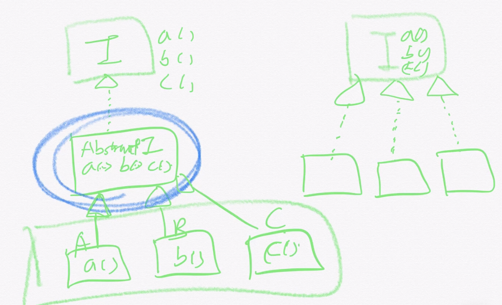

# Section 2

# 인터페이스 기본 메소드와 스태틱 메소드

## 기본 메소드(Default Methods)

- 인터페이스에 메소드 선언이 아니라 구현체를 제공하는 방법
- 해당 인터페이스를 구현한 클래스를 깨트리지 않고 새 기능을 추가할 수 있다.

```java
public class App {
    public static void main(String[] args) {
        Foos foo = new DefaultFoo("jihyeon");
        foo.printName();
        foo.printNameUpperCase();
    }
}
public interface Foos {
    void printName();
    /*
    @implleSpec 이 구현체는 getName()으로 가져온 문자열을 대문자로 바꿔 출력한다.
    */
    default void printNameUpperCase(){
        System.out.println(getName().toUpperCase());
    };
    String getName();
}
public class DefaultFoo implements Foos {
    String name;
    public DefaultFoo(String name){
        this.name = name;
    }
    @Override
    public void printName(){
        System.out.println(this.name);
    }
    @Override
    public String getName(){
        return this.name;
    }
}
```

- 기본 메소드는 **구현체가 모르게 추가된 기능**으로 그만큼 리스크가 있다.
  - 컴파일 에러는 아니지만 구현체에 따라 런타임 에러가 발생할 수 있다.
  - **반드시 문서화할 것.** (@impleSpec 자바독 태그 사용)
- **제약사항**Object가 제공하는 기능(equals,hasCode,toString)는 기본 메소드로 제공할 수 없다.(Object -> java.lang.Object)
  - 추상으로 쳐지도 않는다.
  - 구현체가 재정의해야 한다.
- **본인이 수정할 수 있는 인터페이스에만** 기본 메소드를 제공할 수 있다.
- 인터페이스를 상속받는 인터페이스에서 다시 추상 메소드로 변경할 수 있다.
  - void 원하는메소드();로 변경하는 경우 가능!
- 만약 다른 형태의 메소드를 갖는 두 인터페이스를 받는다면 컴파일 에러가 발생한다!(직접 오버라이딩을 해야 한다! )
- 인터페이스 구현체가 재정의할 수 있다.(@Override 가능!)

## 스태틱 메소드

- 해당 타입 관련 헬퍼 또는 유틸리티 메소드를 제공할 때 인터페이스에 스태틱 메소드를 제공할 수 있다.

```java
    void printName();
    default void printNameUpperCase(){
        System.out.println(getName().toUpperCase());
    };

    static void printAnything() {
        System.out.println("foo");
    }
    String getName();
}

```

> 이래도 가능함!
> [참고](https://docs.oracle.com/javase/tutorial/java/IandI/nogrow.html) > [참고2](https://docs.oracle.com/javase/tutorial/java/IandI/defaultmethods.html)

---

# 자바 8 API의 기본 메소드와 스태틱 메소드

> 자바 8에서 추가한 기본 메소드로 인한 API 변화

## Iterable의 기본 메소드

- forEach()

```java
public class App {
    public static void main(String[] args) {
        List<String> name = new ArrayList<>();
        name.add("jihyeon");
        name.add("watson");
        name.add("jason");
        name.add("suzy");

        name.forEach(System.out::println);
    }
}
```

- spliterator() -> 중요!

```java
public class App {
    public static void main(String[] args) {
        List<String> name = new ArrayList<>();
        name.add("jihyeon");
        name.add("watson");
        name.add("jason");
        name.add("suzy");

        Spliterator<String> spliterator = name.spliterator();
        Spliterator<String> spliterator1 = spliterator.trySplit();
        while(spliterator.tryAdvance(System.out::println));
        System.out.println("---");
        while(spliterator1.tryAdvance(System.out::println));
    }
}
/*jason
suzy
---
jihyeon
watson
*/
```

> Parralel하게 나누게 된다!

## Collection의 기본 메소드(Collection이 Iterable을 상속!)

- stream()/parallelStream()

### Stream 맛보기

```java
public class App {
    public static void main(String[] args) {
        List<String> name = new ArrayList<>();
        name.add("jihyeon");
        name.add("watson");
        name.add("jason");
        name.add("suzy");
        long k = name.stream().map(String::toUpperCase)
        .filter(s -> s.startsWith("J")).count();
        System.out.println(k);
    }
}
//2(j를 하면 안되고, J를 해야한다!)
```

- removeIf(Predicate)

```java
public class App {
    public static void main(String[] args) {
        List<String> name = new ArrayList<>();
        name.add("jihyeon");
        name.add("watson");
        name.add("jason");
        name.add("suzy");
        name.removeIf(s->s.startsWith("j"));
        name.forEach(System.out::println);
    }
}
//watson<br>suzy
```

- spilterator()

## Comparator의 기본 메소드 및 스태틱 메소드

- reversed()

```java
public class App {
    public static void main(String[] args) {
        List<String> name = new ArrayList<>();
        name.add("jihyeon");
        name.add("watson");
        name.add("jason");
        name.add("suzy");
        //name.sort(String::compareToIgnoreCase);
        Comparator<String> compareToIgnoreCase = String::compareToIgnoreCase;
        name.sort(compareToIgnoreCase.reversed());
        name.forEach(System.out::println);

    }
}

```


-> 비어있는 클래스들이 필요없어졌다.
-> 굳이 다 구현할 필요가 없어졌다.(default 덕분이다!)

- thenComparing()
- static reverseOrder()/naturalOrder()
- static nullsFirst()/ nullsLast()
- static comparing()

[Spliterator](https://docs.oracle.com/javase/8/docs/api/java/util/Spliterator.html)
[Iterable](https://docs.oracle.com/javase/8/docs/api/java/lang/Iterable.html)
[Collection](https://docs.oracle.com/javase/8/docs/api/java/util/Collection.html)
[Comparator](https://docs.oracle.com/javase/8/docs/api/java/util/Comparator.html)

---
