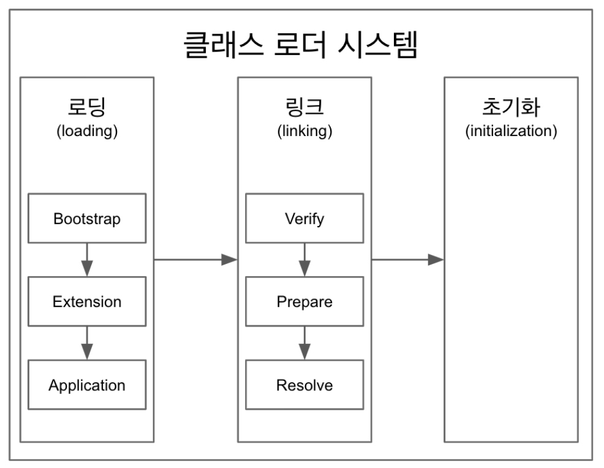

# Section 1


## JVM(Java Virtual Machine)

- 기능 : 클래스 읽어오기, 메모리 올리기, 실행, 인터프리터, JIT 컴파이러를 통해 OS에 특화되게 변환
- 자바 가상 머신으로 자바 바이트 코드(.class)를 OS에 특화된 코드로 변환(인터프리터와 JIT 컴파이럴)하여 실행한다.
  - 자바 파일을 컴파일하면 클래스 파일안에 있는 게 바이트 코드, 바이트 코드를 실행하는게 인터프리터, JIT 컴파일러 등을 통해 네이티브 OS(Mac, 등)을 통해 기계언어로 변환하여 활용함.
- 바이트 코드를 실행하는 표준(JVM 자체는 표준)이자 **구현체**(특정 벤더가 구현한 JVM)다.
- JVM 스펙 : [링크](https://docs.oracle.com/javase/specs/jvms/se11/html/)
- JVM 밴더 : 아마존, 오라클, 등
- 특정 플랫폼에 종속적
- JVM 홀로 제공되지 않고, JRE의 형태로 배포됨!

## JRE(Java Runtime Environment):JVM + 라이브러리

- 자바 애플리케이션을 **실행**할 수 있도록 구성된 배포판.
- JVM과 핵심 라이브러리 및 자바 런타임 환경에서 사용하는 프로퍼티 세팅이나 리소스 파일을 가지고 있다.(rt.jar, character set.jar, property set)
- **개발 관련도구는 포함하지 않는다.**
- 자바 컴파일러는 없다!
- 자바 9부터 모듈 시스템이 들어와서 JRE를 만들수도 있음.
- Java11 부터는 제공하고 있지 않다.

## JDK(Java Development Kit): JRE + 개발 툴

- JRE + 개발에 필요한 툴
- 소스 코드를 작성하 ㄹ때 사용하는 자바 언어는 플랫폼에 독립적
- 오라클은 자바 11부터 JDK만 제공하여 JRE를 따로 제공하지 않는다.
- Write Once Run Anywhere

## 자바

- 프로그래밍 언어
- JDK에 들어있는 자바 컴파일러를 사용하여 바이트 코드로 컴파일할 수 있다.
- 자바 유료화? 오라클에서 만든 Oracle JDK 11 버전부터 상용으로 사용할 떄 유료(하나의 조건이라도 부합하지 않으면 무료 - > 아마존(Amazone Correto)으로 하거나, 공용으로 할때 )
- [자바유료화 이슈](https://medium.com/@javachampions/java-is-still-free-c02aef8c9e04)

## JVM 언어

- JVM 기반으로 동작하는 프로그래밍 언어
- 클로저, 그루비, JRubym, Jython, Kotlin, Scala, 등

## 참고

- [JIT 컴파일러](https://aboullaite.me/understanding-jit-compiler-just-in-time-compiler/)
- [JDK, JRE 그리고 JVM](https://howtodoinjava.com/java/basics/jdk-jre-jvm/)
- [JVM Language](https://en.wikipedia.org/wiki/List_of_JVM_languages)

---

# 2. JVM 구조


## 클래스 로더 시스템 (디코드)

- .class 에서 바이트코드를 읽고 메모리에 저장
- 로딩: 클래스 읽어오는 과정
- 링크: 레퍼런스를 연결하는 과정
- 초기화: static 값들 초기화 및 변수에 할당
  <br>

## 메모리

- 메소드 영역에는 클래스 수준의 정보 (클래스 이름, 부모 클래스 이름, 메소드, 변수) 저장. **공유 자원**이다.
  - ex)App.class.getSuperClass()
- 힙 영역에는 **객체를 저장. 공유 자원**이다.
  -> 아래 영역은 특정 쓰레드에 국한됨!
- 스택 영역에는 쓰레드 마다 런타임 스택을 만들고, 그 안에 메소드 호출을 스택 프레임이라 부르는 블럭으로 쌓는다. 쓰레드 종료하면 런타임 스택도 사라진다.
- PC(Program Counter) 레지스터: 쓰레드 마다 쓰레드 내 현재 실행할 instruction의 위치를 가리키는 포인터가 생성된다.
- 네이티브 메소드 스택

[PC](https://javapapers.com/core-java/java-jvm-run-time-data-areas/#Program_Counter_PC_Register)

## 실행 엔진

- 인터프리터: 바이트 코드를 한줄 씩 실행.
- **JIT 컴파일러**: 인터프리터 효율을 높이기 위해, 인터프리터가 반복되는 코드를 발견하면 JIT 컴파일러로 **반복되는 코드를 모두 네이티브 코드로 바꿔둔다.** 그 다음부터 인터프리터는 네이티브 코드로 컴파일된 코드를 바로 사용한다.
- <매우 중요> **GC(Garbage Collector)**: 더이상 참조되지 않는 객체를 모아서 정리한다.

## JNI(Java Native Interface)

- 자바 애플리케이션에서 C, C++, 어셈블리로 작성된 함수를 사용할 수 있는 방법 제공
- [Native 키워드를 사용한 메소드 호출](https://medium.com/@bschlining/a-simple-java-native-interface-jni-example-in-java-and-scala-68fdafe76f5f0)

## 네이티브 메소드 라이브러리

- C, C++로 작성 된 라이브러리
- 이러한 API에는 native 가 붙어있다.

#### 참고

[JVM Architecture](https://www.geeksforgeeks.org/jvm-works-jvm-architecture/)
[JVM Architecture](https://dzone.com/articles/jvm-architecture-explained)
[JVM Internals](http://blog.jamesdbloom.com/JVMInternals.html)

---

# 3. 클래스 로더



## 클래스 로더

- 로딩, 링크, 초기화 순으로 진행된다.
- 로딩
  - 클래스 로더가 .class 파일을 읽고 그 내용에 따라 적절한 바이너리 데이터를 만들고 “메소드” 영역에 저장.
  - 이때 메소드 영역에 저장하는 데이터
  1. FQCN(Fully Qualified Class Name) -> 경로도 포함됨, 패키지, 클래스, 클래스 로더
  2. 클래스 | 인터페이스 | 이늄
  3. 메소드와 변수
  - 로딩이 끝나면 해당 클래스 타입의 Class 객체를 생성하여 “힙" 영역에 저장.
- 링크
  - Verify, Prepare, Reolve(optional) 세 단계로 나눠져 있다.
  - 검증: .class 파일 형식이 유효한지 체크한다.
  - Preparation: 클래스 변수(static 변수)와 기본값에 필요한 메모리
  - Resolve: 심볼릭 메모리 레퍼런스를 메소드 영역에 있는 실제 레퍼런스로 교체한다. (Optional, 실제 레퍼런스를 가르키고 있지는 않고 그저 레퍼런스)
- 초기화
  - Static 변수의 값을 할당한다. (static 블럭이 있다면 이때 실행된다.)
- 클래스 로더는 계층 구조로 이뤄져 있으면 기본적으로 세가지 클래스 로더가 제공된다.

```java
public class App {
    public static void main(String[] args){
        ClassLoader classLoader = App.class.getClassLoader();
        System.out.println(classloader);
        System.out.println(classloader.getParent()); //PlatformClassLoader
        System.out.println(classloader.getParent()); //native라 출력 불가!    }
}
```

    - 부트 스트랩 클래스 로더 -  JAVA_HOME\lib에 있는 코어 자바 API를 제공한다. 최상위 우선순위를 가진 클래스 로더
    - 플랫폼 클래스로더 - JAVA_HOME\lib\ext 폴더 또는 java.ext.dirs 시스템 변수에 해당하는 위치에 있는 클래스를 읽는다.
    - 애플리케이션 클래스로더 - 애플리케이션 클래스패스(애플리케이션 실행할 때 주는 -classpath 옵션 또는 java.class.path 환경 변수의 값에 해당하는 위치)에서 클래스를 읽는다.
        - 제일 부모한테 읽어오고, 그다음 부모한테 잃어오고, 본인이 하고, 만약에 안되면 **ClassNotFoundException**이 발생!

> 제일 중요한 것은 바이트코드이다.
> 바이트코드가 만들어져야 실행된다!!
> 컴파일->바이트코드생성->JVM

> 바이트 코드를 조작하거나, 직접 날리거나 하는 방법들을 추후에 공부해볼 예정
