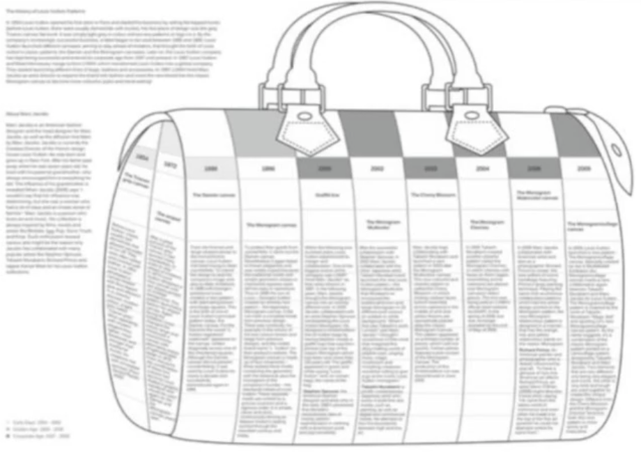

# Section 0

## DevOps, 데브 옵스

: 소프트웨어의 개발과 운영의 합성어

그러나 데브옵스는 단순한 갭라과 운영의 통합을 의미하는 것은 아님

개발팀과 운영팀의 간극을 인지하고 이를 해결하자!

소트트웨어 개발 + 우리의 일에 대한 포괄적인 철학과 방법론

해석과 응용이 존재함!

|       5가지 철학        |                                             |
| :---------------------: | ------------------------------------------- |
|      문화(Culture)      | DevOps를 통해 하나의 문화를 만들어 나감     |
|   자동화(Automation)    | 자동화를 통해 효율성과 빠른 속도를 지향함.  |
|    측정(Measurement)    | 지표를 측정하여 지속적으로 개선해 나갑니다. |
|      공유(Sharing)      | 공유를 통해 함께 발전해 나감.               |
| 축적(File Up & Pile Up) | 기록을 축정ㄱ하여 자산을 만들어 나감        |

| 문화의 구성요소 |                                    |
| :-------------: | ---------------------------------- |
|      사람       | 팀, 인원, 가치, 의사소통           |
|       일        | 프로세스, 방법론                   |
|     서비스      | 서비스의 가치, 성격                |
|      자원       | HW, SW, 기술, 도구                 |
|      시간       | 일정,변경 가능성, 회복탄력성, 예측 |

|  자동화의 구성요소  |                                     |
| :-----------------: | ----------------------------------- |
|   인프라 및 보안    | 클라우드, 네트워크 접근제어, 암호화 |
|    언어 및 도구     | 프로그래밍 및 도구                  |
| 지속적 통합 및 배포 | CI CD 파이프라인 구성 고려          |
|      모니터링       | 모니터링 시스템 및 장애 대응        |

### 측정

- 변경사항 발생 시 항상 측정!
- 어플리케이션 성능, 개발 속도 모니터링
- 지속적으로 나이지고 있는지, 아닌지 측정
- 의사결정 시 추측 배제

### 공유

- 언제든 접근 가능한 투명한 데이터
- 지식의 공유 오픈 마인드!
- 문제 발생시 합꼐 해결
- 일의 가속도

### 축적

> **데브옵스**는 어떤 요구사항을 효율적으로 만족시키기 위하여, 일을 자동화하며 변경사항 지표들을 측정하고, 공유하고 이 모든 결과물들을 지속적으로 측정해 나아가는 문화를 만들어가는 철학 방법론 기술

[참고사이트](https://terraform101.inflearn.devopsart.dev/)

---

# DevOps 엔지니어의 역할

: DevOPs 엔지니어가 갖추어야할 철학과 기술

### DevOps 엔지니어

: 올바른 DevOps 문화를 위해 서비스 혹은 SW LifeCycle에서 반복적인 일들을 자동화하고ㅡ, 기술적 문제 혹은 팀의 차이를 기술적으로 예방하고, 해소시키거나 하는 사람.

기획, 마케팅의 업무도 가능함.

파이프라인 등의 경우도 가능함!

공통되는 기술들을 다양한 곳에 접목하는 것이 핵심임!

> ### Soft Skill
>
> 1. 소프트 스킬은 사회기술, 의사소통 기술, 성격 또는 성격 특성, 태도, 직업 특성, 소셜 인텔리전스 및 감성 인텔리전스 지수 등의 조합으로, 사람들이 환경을 탐색하고 다른 사람들과 잘 일한느 능력을 이야기 한다.
> 2. 문제를 인식하는 능력, 정확하게 선택과 집중을 구별하는 능력, 결정 및 판단 능력 등을 예로 들 수 있다.

| Soft SKill  |                                                                       |
| :---------: | :-------------------------------------------------------------------: |
|  문제인식   |       문제가 무엇이 있는지, 정확한 원인이 무엇인지 파악해야 함.       |
| 선택과 집중 | 문제를 적합한 방법을 통해 해결하고, 해결의 우선순위를 올바르게 설정함 |
|    결정     | 수많은 선택지에 대해서, 추측이 아닌 확신을 가지고 빠르게 결정해야 함  |
|  업의 속성  |             제공하는 서비스의 번질과 가치를 이해해야 함.              |
|   사용자    |      사용자를 이해하고, 요구사항에 대해서 빠르게 피드백 해야함.       |

> ### Technical Skill
>
> 1. 기술적 스킬은 특정한 일을 효과적으로 수행하는 지식과 능력을 이야기 한다.
> 2. IT 영역에서는 프로그래밍 언어 작성 능력, SW 디자인, 데이터베이스 및 서버 관리 등 특정한 기술의 지식과 수행능력을 예로 들 수 있다.

| Technical Skill |                                                                                                                            |
| :-------------: | :------------------------------------------------------------------------------------------------------------------------- |
|   프로그래밍    | Go,Python 등 능숙하게 다룰수 있는 언어는 큰 강점이 됨. Go, Python, Node.js                                                 |
|    운영체제     | Linux와 같은 운영체제를 능숙하게 다루는 것과 개념을 반드시 알아야 함. ex) Shell, OS metrics, File System, 7 Layers         |
|    서버 관리    | 서버를 관리하는 기술과 운영지식을 통해 신뢰할 수 있는 서비스를 구축해야 함. ex) IaC, CI/CD, API, 가용성, 성능              |
|    오픈소스     | 인프라를 이루는 SW 들을 이해하고, 자동화 도구들을 다룰 수 있어야 함. ex)Nginx, Tomcat, MySQL, Redis, Ansible, Terrafrom 등 |
|    클라우드     | 퍼블릭 클라우드를 능숙하게 다루고, 직접 구축 및 설계를 할 수 있어야 함. ex) AWS, Azure, GCP, 등                            |

### Infrastructure as Code, 코드로써의 인프라

Infrastructure as Code, 즉 코드로써의 인프라는 인프라를 이루넌 서버, 미들웨어 그리고 서비스 등, 인프라 구성요소들을 코드를 통해 구축하는 것. IaC는 코드로써의 장점, 즉 작성 용이성, 재사용성, 유지보수 등의 장점을 가진다.

### Terraform by Hashicorp

- Terraform is a tool for building, changing, and versioning infrastructure safely and efficiently.

테라폼은 인프라를 만들고, 변경하고, 기록하는 IaC를 위해 만들어진 도구로써, 문법이 쉬워 비교적 다루기 수비고 사용자가 매우 많아 참고할 수 있는 예제가 많다. AWS, Azure, GCP 같은 퍼블릭 클라우드뿐만이 아닌 다양한 서비스들 역시 지원한다.

DevOps 로드맵 사이트 : [링크](https://roadmap.sh/devops)
